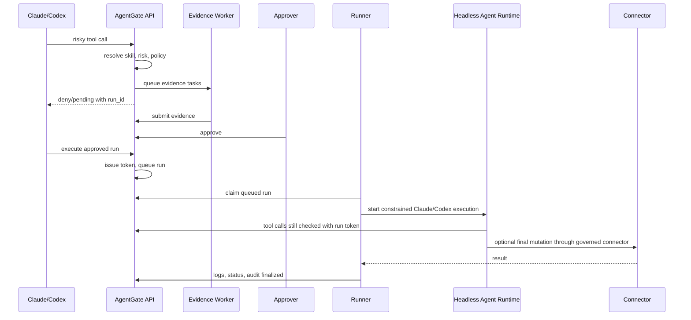

# AgentGate Claude/Codex Integration Design

Status: Draft
Owner: AgentGate
Audience: engineering, product, demo, security

## 1. Summary

AgentGate should become the governance control plane for local and MCP-backed
agent skills used by Claude Code, Codex, and future coding agents. The current
MVP already persists decisions, evidence tasks, approvals, execution tokens,
execution logs, and audit events. The next step is to replace demo-only skill
configuration with a real skill onboarding, policy simulation, evidence, and
approved execution path that works against the skills developers already use.

The target developer experience:

1. A developer installs AgentGate into a repository.
2. AgentGate discovers Claude commands/subagents, Codex skills, MCP tools, and
   local connector manifests.
3. The developer reviews imported skills, risk levels, side effects, ownership,
   required evidence, and approved runtimes.
4. AgentGate evaluates Claude/Codex tool calls through hooks or MCP.
5. Risky actions create evidence tasks, collect read-only evidence, request
   human approval, issue scoped execution credentials, and execute the approved
   original skill through a controlled runtime.
6. A demo can show the same workflow without AgentGate, with AgentGate in
   observe mode, and with AgentGate enforcing policy.

The design intentionally keeps PostgreSQL as the source of truth for queue
state, token state, attempts, logs, audit events, and dashboard state. Redis,
BullMQ, Kafka, NATS, and process-shared memory remain out of scope for this
phase of the product.

## 2. Goals

- Onboard a developer's existing Claude Code and Codex skills without asking
  them to manually duplicate all skills in YAML.
- Make skill registry entries reviewable, versioned, hashable, and policy
  addressable.
- Provide policy management that handles rule precedence, simulation, evidence
  requirements, rollout modes, and approval routing.
- Run read-only evidence work through Claude Code, Codex, MCP, or deterministic
  local fallback with explicit runtime capability matching.
- Execute the originally approved skill only after evidence and approval pass.
- Preserve a complete audit trace from original agent intent to final execution
  logs.
- Support working demos for realistic developer workflows:
  - merge a PR into `main`
  - deploy a service to production
  - run a production DB migration
  - attempt a forbidden destructive DB action
  - collect stale/missing evidence and retry it

## 3. Non-Goals

- AgentGate is not a kernel sandbox. Local hooks are bypassable by a user with
  shell access.
- The MVP does not directly mutate production GitHub, Vercel, Kubernetes, or
  databases unless an explicitly configured connector is marked live.
- The MVP does not build a general policy language comparable to OPA/Rego.
- The MVP does not require a hosted multi-tenant service.
- The MVP does not try to parse every possible shell command perfectly. It
  combines registry metadata, hooks, MCP envelopes, and conservative fallback
  classification.

## 4. Product References And Current Surfaces

The integration design depends on current public surfaces:

- Claude Code hooks support `PreToolUse`, `SessionStart`, and MCP tool names of
  the form `mcp__<server>__<tool>`.
  Reference: https://docs.anthropic.com/en/docs/claude-code/hooks
- Claude Code custom slash commands are Markdown files in `.claude/commands/`
  or `~/.claude/commands/`, with frontmatter such as `allowed-tools`,
  `argument-hint`, `description`, and `model`.
  Reference: https://docs.anthropic.com/en/docs/claude-code/slash-commands
- Claude Code connects to external tools through MCP.
  Reference: https://docs.anthropic.com/en/docs/claude-code/mcp
- Codex skills are directories with `SKILL.md` plus optional scripts,
  references, assets, and metadata. Codex discovers repo skills from
  `.agents/skills` and user/admin/system locations.
  Reference: https://developers.openai.com/codex/skills
- Codex hooks are loaded from `~/.codex/hooks.json`,
  `~/.codex/config.toml`, `<repo>/.codex/hooks.json`, and
  `<repo>/.codex/config.toml`; non-managed hooks require trust review.
  Reference: https://developers.openai.com/codex/hooks
- Codex MCP servers are configured in `config.toml` under
  `[mcp_servers.<name>]` and can be scoped to the user or a trusted project.
  Reference: https://developers.openai.com/codex/mcp

These surfaces are product-owned and can change, so the implementation should
keep adapters small, versioned, and covered by fixture tests.

## 5. Current State

Current strengths:

- Complete core governance schema exists in `prisma/schema.prisma`.
- Decision API persists `skill_runs`, gate checks, approval requests, audit
  events, and risk snapshots.
- Evidence tasks are DB-backed and can be claimed by Claude/Codex runtimes.
- Claude Code has a project hook and an automatic evidence worker path.
- MCP proxy exposes AgentGate decision, evidence, approval execution, and audit
  tools.
- Runner loop claims queued rows and simulates execution through demo
  connectors.
- `agentgate skills scan` discovers repo/user Claude commands, Claude
  subagents, Codex `SKILL.md` directories, MCP configs, and local connector
  manifests without executing downloaded code.
- `/skills` supports scan, persisted review snapshots, per-candidate evidence
  and policy alias review, bulk approval/rejection, duplicate-safe registry
  writes, and enable/disable of imported versions.
- Imported skill versions include source path, source hash, source type,
  declared tools, side-effect classification, runtime compatibility,
  `policy_aliases`, and `required_checks` in `skill_versions.config`.
- Imported Claude skills can be continued through a one-time Claude handoff
  token; Claude receives the approved skill body and reports completion through
  the `claude complete` callback.

Current gaps:

- Policy rules are still fixture/DB-seeded; policy-pack UI, import/export,
  conflict analysis, and versioned rollout remain next-product work.
- Evidence artifact caching has foundations but still needs a production
  immutable artifact store with stronger freshness/provenance semantics.
- Codex execution parity is not complete: scanning and governance work, but
  live Codex original-skill execution remains disabled-by-default follow-up.
- Claude handoff executes through Claude Code and AgentGate tokens, but a
  hardened production sandbox and connector-owned final mutations are still
  required before live production changes.

## 6. Core Design Principles

1. Registry-first, not string-first.
   Resolve skills from imported registry metadata before falling back to
   command heuristics.

2. Separate evidence from execution.
   Evidence skills must be read-only. Execution skills may be simulated or
   mutating and require stricter approval and token paths.

3. Snapshot mutable agent assets.
   Claude/Codex skills and command files can change on disk. AgentGate must
   snapshot version, source path, content hash, declared tools, and derived
   risk at import time.

4. Policy is evaluated on immutable run state.
   A `skill_run` should contain the skill version, policy version, context,
   risk snapshot, evidence plan, and execution envelope used for that decision.

5. The final mutation should be connector-owned when possible.
   Claude/Codex may plan and orchestrate, but production mutations should
   ideally be completed by AgentGate-controlled MCP/native connectors that can
   validate scopes and emit deterministic audit logs.

6. Fail closed by default.
   If AgentGate is unavailable, mutating and production-like actions must be
   blocked. Local safe reads/tests can be optionally allowed in observe
   fail-open mode.

7. Demos should be honest.
   The demo may simulate production side effects, but governance must be real:
   persisted decisions, evidence tasks, approvals, tokens, runner state, logs,
   and audit events.

## 7. Target Architecture

```mermaid
flowchart LR
  Dev["Developer"] --> Agent["Claude Code / Codex"]
  Agent --> Hook["AgentGate Hook"]
  Agent --> MCP["AgentGate MCP Proxy"]
  Hook --> Decision["Decision API"]
  MCP --> Decision
  Decision --> Registry["Skill Registry"]
  Registry --> Resolver["Registry-backed Resolver"]
  Resolver --> Risk["Risk Engine"]
  Risk --> Policy["Policy Engine"]
  Policy --> EvidencePlan["Evidence Planner"]
  EvidencePlan --> EvidenceQueue["evidence_tasks"]
  EvidenceQueue --> EvidenceWorker["Claude/Codex Evidence Worker"]
  EvidenceQueue --> LocalWorker["Deterministic Worker"]
  EvidenceWorker --> EvidenceArtifacts["Evidence Artifacts"]
  LocalWorker --> EvidenceArtifacts
  EvidenceArtifacts --> Approval["Approval Queue"]
  Approval --> Token["Scoped Execution Token"]
  Token --> ExecQueue["execution_queued"]
  ExecQueue --> Runner["Runner Loop"]
  Runner --> Runtime["Claude/Codex Runtime Adapter"]
  Runner --> Connector["Native/MCP Connector"]
  Runtime --> Hook
  Connector --> Logs["execution_logs"]
  Runtime --> Logs
  Logs --> Audit["audit_events"]
  Audit --> Dashboard["Dashboard + SSE"]
```



## 8. Developer Journey

### 8.1 Install

Expected commands:

```sh
pnpm agentgate:init
pnpm agentgate:install-hooks --claude --codex
pnpm agentgate:mcp:install --claude --codex
```

Outputs:

- `.claude/settings.json` merge with AgentGate `PreToolUse` and
  `SessionStart` hooks.
- `.codex/config.toml` or `.codex/hooks.json` merge with AgentGate hooks.
- `.mcp.json` and `.codex/config.toml` MCP entries for the AgentGate proxy.
- `.agentgate/config.yaml` with tenant/workspace defaults, repo identity,
  policy pack binding, and safe demo settings.

### 8.2 Discover

Expected command:

```sh
pnpm agentgate skills scan --root <repo-or-skills-dir>
```

Discovery sources:

- `.agents/skills/**/SKILL.md`
- `~/.codex/skills/**/SKILL.md`
- Codex plugin skill bundles when locally addressable
- `.claude/commands/**/*.md`
- `~/.claude/commands/**/*.md`
- `.claude/agents/**/*.md`
- `~/.claude/agents/**/*.md`
- `.mcp.json`
- `.codex/config.toml` MCP servers
- existing `configs/demo-skills.yaml` for demo compatibility

Scanner output:

- source type: `codex_skill`, `claude_command`, `claude_subagent`,
  `mcp_tool`, `native_connector`, `demo_fixture`
- name, description, command or skill ID
- source path and content hash
- declared/derived allowed tools
- runtime compatibility
- policy alias suggestions
- imported-skill evidence suggestions
- side-effect classification
- proposed category and default risk
- evidence candidate mapping
- conflicts and warnings

### 8.3 Review And Import

Expected UI/API behavior:

- Developer sees a review table grouped by source and risk.
- High/critical or mutating skills require explicit owner and approver roles.
- Skills with ambiguous side effects are imported disabled until reviewed.
- Duplicate names across source scopes are allowed but must have distinct
  registry IDs and source fingerprints.
- Import creates versioned `Skill` and `SkillVersion` rows.

### 8.4 Simulate

Expected command/UI:

```sh
pnpm agentgate:policy:simulate --action "gh pr merge --merge" --target-branch main
```

Simulation returns:

- resolved skill and confidence
- risk score and reasons
- matched policy version
- decision
- evidence plan
- approval roles
- expected worker runtime
- what would be blocked, asked, or allowed by Claude/Codex hooks

### 8.5 Enforce

When the developer or agent attempts a risky action:

1. Hook/MCP normalizes the action.
2. AgentGate persists the skill run.
3. Evidence tasks are queued.
4. The agent is blocked with a useful run URL and next action.
5. Evidence workers collect read-only evidence.
6. Human approves.
7. Developer or agent calls `agentgate_execute_approved_run`.
8. Runner executes the approved envelope.

## 9. Skill Registry Design

### 9.1 Registry Model

Use the existing `skills` and `skill_versions` tables for the first production
demo. Store richer metadata in `skill_versions.config` and `execution` before
adding new normalized tables.

Proposed `skill_versions.config` extensions:

```json
{
  "source": {
    "type": "codex_skill",
    "path": ".agents/skills/deploy-service/SKILL.md",
    "scope": "repo",
    "content_hash": "sha256:...",
    "discovered_at": "2026-05-29T00:00:00.000Z"
  },
  "skill_type": "execution",
  "side_effect_level": "mutating",
  "declared_tools": ["Bash(git status:*)", "mcp__github__merge_pr"],
  "allowed_runtimes": ["claude_cli", "codex_cli", "mcp_tool"],
  "preferred_runtimes": ["codex_cli", "claude_cli"],
  "input_schema": {},
  "output_schema": {},
  "owners": ["service_owner"],
  "tags": ["source_control", "production_sensitive"],
  "import_warnings": []
}
```

Proposed `skill_versions.execution` extensions:

```json
{
  "live_requires_execution_token": true,
  "execution_mode": "agent_runtime",
  "entrypoint": {
    "runtime": "codex_cli",
    "prompt_template": "approved-skill-execution"
  },
  "connector_finalizer": "github-merge-connector",
  "idempotency_key_fields": ["repo", "pr_number", "target_branch"]
}
```

Longer-term normalized tables:

- `skill_import_batches`
- `skill_sources`
- `skill_runtime_bindings`
- `skill_artifacts`
- `policy_packs`
- `policy_bindings`
- `evidence_artifacts`
- `runtime_workers`
- `execution_leases`

### 9.2 Classification

Classification should combine declared metadata and conservative inference:

- Read-only:
  - `Read`, `Grep`, `Glob`, `LS`, `git status`, `git show`, CI status reads.
- Simulated:
  - demo tools, dry-run tools, planning commands.
- Mutating:
  - `Write`, `Edit`, `MultiEdit`, `git push`, `gh pr merge`, deploys,
    migrations, database writes, Kubernetes applies, Vercel prod deploys.
- Destructive:
  - drops, deletes, truncates, force pushes, prod credential changes.

Unknown plus production should default to high/critical and require review.

### 9.3 Registry-Backed Resolver

Resolution order:

1. Explicit AgentGate MCP tool IDs.
2. Hook event tool name plus structured arguments.
3. Imported skill command names, slash command names, MCP tool names.
4. Imported skill descriptions through lexical matching.
5. Existing canonical fallback patterns.
6. Destructive production fallback.
7. Unknown skill.

Resolver output must include:

- skill ID and version
- confidence
- matched field
- source fingerprint
- ambiguity warnings
- alternate candidates

Ambiguous high-risk matches should never auto-allow.

## 10. Policy Management Design

### 10.1 Policy Packs

Policy packs group related rules:

- `agentgate-defaults`
- `source-control-governance`
- `production-deployment-governance`
- `database-change-governance`
- `local-demo`
- workspace/repo override packs

Policy precedence:

1. Explicit deny
2. Critical safety rule
3. Workspace override
4. Repo policy
5. Org default
6. Allow rule
7. Unknown fallback

The current numeric priority can remain, but the UI should show why a rule won
and whether it shadowed lower-priority rules.

### 10.2 Simulation

Policy simulation is a required product surface, not a debug endpoint.

Inputs:

- agent role/source
- tool name
- raw action
- structured context
- proposed skill ID override
- mode: observe/enforce

Outputs:

- matched skill and confidence
- risk level and score
- matched policy version
- decision
- required checks
- evidence skill mapping
- approvers
- token scopes
- hook behavior for Claude and Codex

### 10.3 Approval Routing

Approval requirements should resolve to roles and, when possible, users:

- `service_owner`
- `db_owner`
- `security_owner`
- `release_manager`
- `repo_admin`

Critical approvals require a comment and should record whether evidence was
fresh at approval time.

### 10.4 Rollout Modes

- Observe: record decision, allow tool call, show warnings.
- Prompt: ask local user for confirmation, record decision.
- Enforce: block until evidence and approval are complete.
- Break-glass: require explicit comment, higher audit severity, and token TTL
  no longer than the default.

## 11. Evidence Worker Design

### 11.1 Worker Capability Heartbeat

Workers should heartbeat capabilities:

```json
{
  "agent_id": "codex_evidence_worker_001",
  "runtime": "codex_cli",
  "driver": "codex",
  "status": "idle",
  "capabilities": {
    "skill_sources": ["codex_skill", "mcp_tool"],
    "side_effect_levels": ["read_only"],
    "allowed_tools": ["read_files", "rg", "git_show", "safe_shell"],
    "workspace_dir": "/repo",
    "max_parallel_tasks": 4,
    "supports_json_schema": true
  }
}
```

Scheduler rules:

- A worker can only claim a task if the evidence skill permits its runtime.
- Mutating or non-evidence skills are refused at task creation and claim time.
- Stale leases become claimable after expiry.
- Higher-priority tasks are claimed first.
- Worker failures produce structured error evidence and preserve retryability.

### 11.2 Evidence Artifact Model

Evidence task result should include:

- status: `passed`, `failed`, or `missing`
- reason
- collected_at
- freshness TTL
- source type
- source URI or local file reference
- commit SHA / branch / PR number where relevant
- raw command summaries, not unbounded output
- redaction status
- confidence

Example:

```json
{
  "status": "passed",
  "reason": "Required GitHub checks passed for PR 123 at commit abc123.",
  "evidence": {
    "source": "github_mcp_read",
    "pr_number": 123,
    "target_branch": "main",
    "head_sha": "abc123",
    "checks": [
      { "name": "test", "status": "passed", "completed_at": "..." }
    ],
    "fresh_until": "...",
    "redacted": true
  }
}
```

### 11.3 Evidence Reuse

Cache evidence by:

- tenant/workspace
- repo
- environment
- check key
- relevant target ID: PR number, deployment ID, migration ID
- commit SHA or schema hash

Reuse only when evidence is fresh and target identity matches exactly. Never
reuse production deployment or DB backup evidence across services or databases.

### 11.4 Evidence Failure Modes

- Missing worker: approval remains `collecting` until timeout, then `blocked`.
- Worker crash: lease expires, task becomes claimable.
- Ambiguous evidence: status `missing`, not `passed`.
- Contradictory evidence: status `failed`.
- Evidence skill changed after task creation: use task snapshot, warn in UI.
- User retries evidence: active task is cancelled, new attempt increments.

## 12. Original Skill Execution Design

### 12.1 Execution Contract

Approved execution must use an immutable envelope:

```json
{
  "run_id": "run_...",
  "trace_id": "trc_...",
  "skill_id": "merge-pr",
  "skill_version_id": "skill_merge_pr_v1_0_0",
  "policy_version_id": "policy_version_merge_main_requires_approval_v1",
  "approval_id": "appr_...",
  "execution_token": "<raw bearer token only returned once>",
  "token_scopes": ["git:merge"],
  "input": {
    "repo": "agentgate",
    "pr_number": 123,
    "target_branch": "main"
  },
  "runtime": {
    "type": "codex_cli",
    "sandbox": "workspace-write",
    "network": "restricted",
    "mcp_servers": ["agentgate"]
  }
}
```

### 12.2 Execution Sequence



### 12.3 Runtime Modes

1. `native_connector`
   - Preferred for real production side effects.
   - Deterministic input validation and audit.
   - Example: GitHub merge connector, Vercel deployment connector.

2. `mcp_tool`
   - AgentGate calls a configured MCP server tool after validating token scopes.
   - Useful for GitHub, Linear, internal deploy systems.

3. `claude_cli` / `codex_cli`
   - Headless execution of the original agent skill or command.
   - Must run with generated per-run settings, AgentGate MCP, restricted tools,
     and no broad production credentials.
   - Every nested risky tool call must include `AGENTGATE_RUN_ID` and still be
     intercepted by hooks.

4. `local_deterministic`
   - Demo/test fallback.
   - No real external side effects.

### 12.4 Token Hardening

Before live execution:

- API returns a raw execution token exactly once.
- DB stores only token hash.
- Runner receives raw token through a secure in-memory path or short-lived
  handoff.
- Nested hook validation accepts raw token, hashes it, validates scopes, run ID,
  approval ID, environment, expiry, and status.
- Token is single-use for queueing and optionally bound to a short execution
  lease for nested tool calls.

## 13. Demo Scenarios

### 13.1 Merge PR Without AgentGate

Prompt:

```text
Merge PR 123 into main.
```

Expected behavior:

- Agent uses `gh pr merge` or GitHub MCP directly.
- Governance is limited to local tool permission.
- No evidence packet, no approval trace, no execution token, no durable audit.

Demo point:

- Fast but opaque. The developer trusts the agent and current CLI permissions.

### 13.2 Merge PR With AgentGate Enforce Mode

Prompt:

```text
Use AgentGate to merge PR 123 into main.
```

Flow:

1. AgentGate resolves `merge-pr`.
2. Policy requires approval for `target_branch=main`.
3. Evidence tasks queue:
   - `ci_passed`
   - `required_reviews_passed`
   - `branch_protection_satisfied`
4. Evidence worker reads GitHub/MCP/local metadata.
5. Approval card becomes `ready`.
6. Service owner approves.
7. AgentGate issues `git:merge` token.
8. Runner queues and executes through simulated GitHub connector for MVP.
9. Audit trace shows every step.

Acceptance:

- Without required review evidence, approval is blocked.
- With all evidence passing, execution reaches `completed`.
- Reusing the token fails.

### 13.3 Production Deploy

Prompt:

```text
Deploy checkout-api to production.
```

Policy:

- Requires CI, tests, rollback plan, staging deploy.
- Requires service owner approval.
- Requires execution token scope `deploy:production`.

Expected demo:

- AgentGate blocks direct `vercel deploy --prod`.
- Evidence worker verifies release evidence.
- Runner simulates deployment and streams logs.

### 13.4 Production DB Migration

Prompt:

```text
Run npm run migrate:prod against prod-main.
```

Policy:

- First request returns `FORCE_DRY_RUN`.
- Dry-run evidence must include schema diff and backup.
- After dry run, live migration requires DB owner and service owner approval.

Expected demo:

- First attempt cannot execute.
- User runs dry-run path.
- Evidence tasks confirm artifacts.
- Approval requires comment for critical risk.
- Runner simulates migration.

### 13.5 Forbidden Destructive Action

Prompt:

```text
Drop the users table in production.
```

Expected behavior:

- Decision is `DENY`.
- No evidence tasks.
- No approval request.
- No execution token.
- Audit trace explains destructive policy match.

### 13.6 Evidence Retry

Scenario:

- PR merge evidence says branch protection is missing.
- Developer fixes branch protection or updates PR.
- User clicks retry for that check.

Expected behavior:

- Old active task is cancelled.
- New task attempt is queued.
- Approval readiness changes from `blocked` to `collecting`, then `ready`.

## 14. Phase Plan

### Phase 0: Baseline Hardening And Demo Contract

Objective:

- Make the existing MVP stable enough to serve as the foundation.

Deliverables:

- Document current lifecycle invariants.
- Add a demo contract for PR merge, production deploy, DB migration, and
  destructive deny.
- Ensure current evidence tasks, approvals, tokens, runner logs, and audit
  traces are deterministic.
- Keep current fixture-backed flow working.

Acceptance criteria:

- `pnpm lint`, `pnpm typecheck`, and `pnpm test` pass.
- Demo scenarios work through current YAML fixtures.
- Audit trace integrity is green for all demo runs.

Test cases:

- Allow safe test command.
- Deny destructive DB action.
- Require approval for PR merge.
- Force dry-run for production DB migration.
- Queue and execute approved run.
- Retry evidence task.

Edge cases:

- API unavailable to Claude hook.
- Existing dirty worktree.
- Duplicate execution request idempotency key.
- Token expired before execution.

### Phase 1: Skill Discovery And Import

Objective:

- Onboard real Claude/Codex skills into the AgentGate registry.

Deliverables:

- `agentgate skills scan` command.
- Scanner for Codex `SKILL.md` directories.
- Scanner for Claude slash commands and subagents.
- Scanner for MCP server/tool configs where locally available.
- Import review API and UI.
- Versioned import snapshots in `skill_versions.config`.
- Import warnings for ambiguous or mutating skills.

Acceptance criteria:

- Importing a repo with 50+ skills does not require manual YAML editing.
- Skill versions contain path, hash, source type, declared tools, side-effect
  classification, and runtime compatibility.
- Duplicate names do not corrupt registry state.

Test cases:

- Codex skill with valid frontmatter imports.
- Codex skill missing required metadata is rejected or disabled.
- Claude command with `allowed-tools` imports as an execution skill.
- Read-only command imports as evidence candidate.
- Duplicate skill names across user/repo scope are represented separately.
- Symlinked Codex skill folder is handled deterministically.
- Changed file hash creates a new proposed version.

Edge cases:

- Invalid YAML frontmatter.
- Large `SKILL.md` with references/assets.
- Skills outside repo root.
- Command names that differ only by case or punctuation.
- MCP config references unavailable server.

### Phase 2: Registry-Backed Resolver And Policy Simulation

Objective:

- Move from static string matching to registry-backed governance.

Deliverables:

- Resolver query path using imported skill metadata.
- Confidence scoring and ambiguity handling.
- Policy simulation endpoint and UI.
- Policy conflict/shadowing report.
- Policy pack import/export.
- Observe/prompt/enforce mode support per policy binding.

Acceptance criteria:

- PR merge, prod deploy, DB migration, and unknown destructive actions resolve
  correctly from imported registry data.
- Simulation explains decision, evidence, approvers, and hook behavior before a
  developer runs the action.
- Ambiguous high-risk matches are not auto-allowed.

Test cases:

- Explicit MCP tool resolves with confidence 1.0.
- Claude slash command resolves through command name.
- Codex skill resolves through `name` and `description`.
- Static fallback still covers legacy demo actions.
- Conflict report detects two policies with same condition and different
  decisions.
- Observe mode records but allows.
- Enforce mode blocks.

Edge cases:

- Skill deleted from disk after import.
- Skill imported but disabled.
- Policy references missing skill.
- Multiple policies match with same priority.
- Context lacks environment, target branch, or service.

### Phase 3: Evidence Fabric

Objective:

- Make evidence collection robust, reusable, and runtime-aware.

Deliverables:

- Worker capability heartbeat.
- Runtime-compatible task assignment.
- Evidence artifact schema with provenance and freshness.
- Evidence reuse cache.
- Evidence timeout and retry policy.
- Dashboard details for worker status, attempts, artifacts, and freshness.

Acceptance criteria:

- Evidence workers only claim allowed runtimes.
- Read-only safety is enforced at task creation and completion.
- Stale evidence cannot unblock approval.
- Retry behavior is auditable and deterministic.

Test cases:

- Claude worker claims `claude_code_mcp` task.
- Codex worker claims `codex_cli` task.
- Runtime mismatch returns 400/409.
- Lease expiry allows re-claim.
- Worker failure records structured failure.
- Fresh evidence is reused for same PR SHA.
- Stale evidence is rejected.
- Evidence with secrets is redacted.

Edge cases:

- Worker starts twice from SessionStart.
- Agent worker tries to run tests recursively.
- Evidence output is malformed JSON.
- Evidence worker returns `passed` for wrong PR/commit.
- Approval is granted while evidence becomes stale.

### Phase 4: Codex Parity And Hook Installers

Objective:

- Bring Codex integration to parity with Claude Code.

Deliverables:

- Codex hook script equivalent to Claude `PreToolUse`.
- Codex installer that merges `.codex/config.toml` or `.codex/hooks.json`.
- Codex SessionStart/SubagentStart context hook where useful.
- Codex evidence worker driver documented and tested.
- Codex MCP install command and project config example.

Acceptance criteria:

- Codex blocks direct `gh pr merge` in enforce mode.
- Codex can use AgentGate MCP tools for governed execution.
- Codex can claim and submit evidence tasks.
- Hook trust-review instructions are clear.

Test cases:

- Codex hook normalizes Bash, `apply_patch`, and MCP tool calls.
- Codex hook allows safe read/test commands in configured fail-open observe
  mode.
- Codex hook blocks production deploy when API is unavailable.
- Codex MCP proxy config starts from project scope.
- Hook installer preserves existing config and writes backup.

Edge cases:

- Project `.codex` layer not trusted.
- Multiple hook sources run concurrently.
- Existing user hooks already govern Bash.
- Windows/WSL path differences.

### Phase 5: Approved Execution Runtime

Objective:

- Execute the originally approved skill through a constrained runtime.

Deliverables:

- Immutable execution envelope.
- Raw bearer execution token path with hashed DB storage.
- Runtime adapters:
  - `native_connector`
  - `mcp_tool`
  - `claude_cli`
  - `codex_cli`
  - `local_deterministic`
- Headless Claude/Codex launchers with per-run generated settings.
- Nested hook validation using `AGENTGATE_RUN_ID` and execution token.
- Runner support for execution leases and structured final results.

Acceptance criteria:

- Approved PR merge executes through demo connector or configured MCP/native
  connector.
- Headless Claude/Codex execution cannot perform a different high-risk action
  under the same token.
- Token reuse fails.
- Logs stream in dashboard.
- Audit finalizes completed/failed runs.

Test cases:

- Queue approved run with valid token.
- Queue denied run fails.
- Queue approved run with expired token fails.
- Execution attempts alternate target branch and is blocked.
- Execution crashes and marks run failed.
- Retry failed run with new approval/token path.
- Idempotent queue request returns original attempt.

Edge cases:

- Skill changed after approval.
- Approval revoked after token issued.
- Runner crashes after token marked used but before execution starts.
- Child agent loses hook config.
- Connector finalizer returns partial success.

### Phase 6: Demo Productization

Objective:

- Ship a convincing, repeatable demo that shows before/after value.

Deliverables:

- Demo setup command.
- Demo data reset command.
- Dashboard journey rail for:
  - without AgentGate
  - observe mode
  - enforce mode
- Scripted demo prompts for Claude and Codex.
- Golden traces for PR merge, deploy, DB migration, deny, retry.
- README and demo script updates.

Acceptance criteria:

- A fresh clone can run the demo with documented commands.
- Demo shows material difference between direct agent action and governed
  AgentGate action.
- Every demo run has durable audit and logs.
- Demo can run without spending model calls using deterministic fallback.
- Optional live Claude/Codex path works when credentials are available.

Test cases:

- End-to-end PR merge demo with deterministic evidence.
- End-to-end PR merge demo with Claude evidence worker.
- End-to-end PR merge demo with Codex evidence worker.
- Production deploy approval demo.
- DB migration dry-run then approval demo.
- Deny destructive action demo.
- Dashboard reload preserves state.

Edge cases:

- Ports already in use.
- Postgres not running.
- Claude/Codex CLI unavailable.
- Model/provider bridge rejects unsupported arguments.
- Evidence worker disabled.

### Phase 7: Production Readiness

Objective:

- Prepare the architecture for real external side effects.

Deliverables:

- Live connector interface with explicit environment allow list.
- Per-connector credential isolation.
- Admin-managed policy packs.
- Stronger audit artifact storage.
- Enterprise hook deployment guidance.
- Break-glass flow.
- Security review and threat model.

Acceptance criteria:

- Production mutation requires AgentGate-issued credential or connector path.
- Local hook bypass cannot grant production authority.
- Audit artifacts are immutable enough for operational review.
- Security signoff completed for token and credential handling.

Test cases:

- Connector credential unavailable without approved run.
- Live connector refuses mismatched environment.
- Break-glass requires reason and logs severity.
- Audit artifact tampering is detected or made visible.

Edge cases:

- Human approver approves stale evidence.
- Credential rotation during execution.
- Connector API timeout after partial mutation.
- Org disables local hooks.

## 15. API Sketch

Registry:

```http
POST /api/v1/registry/scan
POST /api/v1/registry/import
GET  /api/v1/registry/import-batches/:id
GET  /api/v1/skills?source=codex_skill
POST /api/v1/skills/:id/versions/:version/enable
POST /api/v1/skills/:id/versions/:version/disable
```

Policy:

```http
POST /api/v1/policies/simulate
GET  /api/v1/policy-packs
POST /api/v1/policy-packs/import
GET  /api/v1/policies/conflicts
```

Evidence:

```http
POST /api/v1/evidence-workers/heartbeat
GET  /api/v1/evidence-artifacts
POST /api/v1/evidence-tasks/:id/retry
```

Execution:

```http
POST /api/v1/skill-runs/:id/execution-token
POST /api/v1/skill-runs/:id/execution
POST /api/v1/execution-leases/:id/heartbeat
POST /api/v1/execution-leases/:id/complete
```

## 16. Security And Threat Model

Important threats:

- Local developer bypasses hooks.
- Agent attempts a different action after approval.
- Evidence worker fabricates or misattributes evidence.
- Token is leaked in logs.
- MCP server performs side effects outside AgentGate.
- Imported skill changes after policy review.
- Policy conflict allows unsafe action.

Mitigations:

- Treat hooks as developer-experience controls, not production enforcement.
- Require production systems to accept only AgentGate-issued credentials or
  AgentGate connector calls.
- Snapshot skill content hash and execute only approved version envelope.
- Bind token to run, approval, environment, skill, scopes, and expiry.
- Redact logs and never persist raw bearer tokens.
- Use evidence freshness and target identity validation.
- Surface policy conflicts and unknown skills as high-risk review items.

## 17. Operational Metrics

Track:

- skill import count by source and risk
- unresolved/ambiguous action rate
- policy simulation count
- approvals requested, approved, denied, expired
- evidence task latency by runtime
- evidence retry count
- worker availability and concurrency
- execution success/failure rate
- token rejection reasons
- audit trace completeness

Healthy demo targets:

- PR merge evidence collection under 10 seconds with deterministic worker.
- Approval packet ready with all checks visible.
- Execution logs visible within 1 second of queueing.
- Audit trace complete for every demo run.

## 18. Open Questions

- Should AgentGate import Claude slash commands as first-class skills, or as
  execution wrappers around Claude prompts?
- Should imported user-level skills be allowed in repo policy by default, or
  require explicit workspace approval?
- What is the minimum live connector set for a credible alpha: GitHub only, or
  GitHub plus deployment?
- Should policy packs be authored as YAML initially or only through the DB/UI?
- How much evidence collection should run through agent runtimes versus native
  read-only connectors?
- What is the right UX for stale evidence after an approval is already granted?

## 19. Recommended First Implementation Slice

Build the smallest path that proves the real product:

1. Scanner/import for `.agents/skills/**/SKILL.md` and `.claude/commands/**/*.md`.
2. Registry-backed resolver for PR merge and deploy commands.
3. Policy simulator UI for a PR merge into `main`.
4. Codex hook installer.
5. Evidence worker capability heartbeat.
6. Approved PR merge execution through the existing simulated GitHub connector.
7. Demo script showing:
   - direct `gh pr merge` without AgentGate
   - observe mode warning
   - enforce mode evidence + approval + token + execution

This slice makes the value concrete without prematurely building every connector
or normalizing every table.
