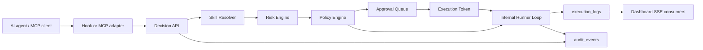

# Architecture

AgentGate is a schema-first TypeScript monorepo.

Phase 0 provides the repository foundation, complete Prisma schema, deterministic fixtures, placeholder apps, and local Postgres setup. Later phases fill in the decision pipeline, approval lifecycle, dry-run evidence, token validation, runner state machine, and SSE streaming.
