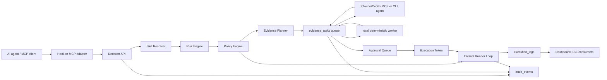

# Architecture

AgentGate is a schema-first TypeScript monorepo.

Phase 0 provides the repository foundation, complete Prisma schema, deterministic fixtures, placeholder apps, and local Postgres setup. Later phases fill in the decision pipeline, approval lifecycle, dry-run evidence, token validation, runner state machine, and SSE streaming.

## Async Evidence Pipeline

When a policy requires approval checks, the Decision API resolves one read-only evidence skill per check from the skill registry and creates one `evidence_tasks` row per check. The approval packet enters `approval_readiness=collecting`, each gate check becomes `running`, and the browser can show an ongoing evidence pipeline instead of a prefilled approval card.

Evidence skills live in `configs/demo-skills.yaml` and are stored in `skill_versions.config` with `skill_type: evidence`, `side_effect_level: read_only`, `check_key`, and runtime preferences. Existing local databases also materialize these evidence skills on demand the first time a check runs, so reseeding is not required for the runtime path.

Runtime selection supports:

- `claude_code_mcp` and `codex_mcp`: external agent runtimes that claim tasks through the AgentGate MCP proxy, inspect the task input, execute only read-only evidence skills, and submit results.
- `claude_cli` and `codex_cli`: direct CLI runtime labels for future adapters; they use the same claim/submit contract.
- `local_deterministic`: deterministic local fallback used for demo fixtures, tests, and `pnpm evidence:process`. This worker claims and completes multiple tasks per tick with bounded concurrency; set `AGENTGATE_EVIDENCE_WORKER_CONCURRENCY` to tune it.
- `native_connector`: read-only connector adapter shape; disabled unless explicitly configured for simulated use.
- `internal_simulated_agent`: test/demo adapter disabled unless `AGENTGATE_EVIDENCE_INTERNAL_AGENT=true`.
- legacy `agent`: accepted in older records and normalized to `claude_code_mcp`.

`pnpm evidence:claude-worker` is the external-agent worker path. It polls the API, claims queued tasks, heartbeats the lease, launches headless Claude or Codex in a read-only mode, submits structured evidence, and fails the task with a reason if the agent command errors or times out. It defaults to one task at a time, but `AGENTGATE_EVIDENCE_AGENT_MAX_TASKS_PER_TICK` plus `AGENTGATE_EVIDENCE_AGENT_CONCURRENCY` can opt into parallel agent subprocesses. The project Claude `SessionStart` hook can start this worker automatically when Claude Code opens.

An evidence retry cancels any active task for that gate check, creates a fresh task with an incremented attempt, and sets that gate check back to `running`. When all active tasks finish, AgentGate updates the approval to `ready` if every gate check passed or `blocked` with reasons if any evidence failed or is missing. Critical actions still require human approval after evidence is ready.

The runtime guard refuses to execute non-evidence or mutating skills, so approval evidence cannot trigger the target deploy, merge, or database mutation skill. Results are persisted on `gate_check_results.evidence`, task lifecycle is persisted in `evidence_tasks`, and every queue/claim/complete/fail transition is logged through `audit_events`.
